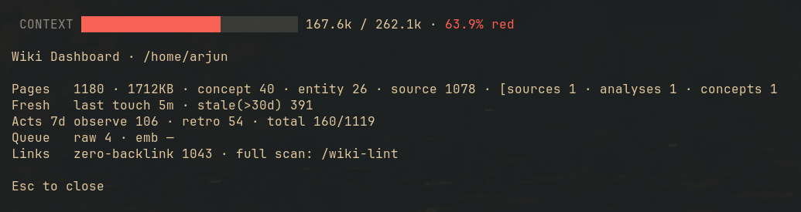

<div align="center">

# @zosmaai/pi-llm-wiki

<a href="./README.md">English</a> | <a href="./README.zh.md">中文</a> | <a href="./README.es.md">Español</a> | <a href="./README.ja.md">日本語</a> | <a href="./README.de.md">Deutsch</a> | <a href="./README.fr.md">Français</a> | <a href="./README.pt.md">Português</a> | <a href="./README.ru.md">Русский</a> | <a href="./README.ko.md">한국어</a> | **हिंदी**

[](https://github.com/zosmaai/pi-llm-wiki/actions/workflows/ci.yml)
[](https://www.npmjs.com/package/@zosmaai/pi-llm-wiki)
[](https://www.npmjs.com/package/@zosmaai/pi-llm-wiki)
[](https://codecov.io/gh/zosmaai/pi-llm-wiki)
[](LICENSE)
[](https://zosmaai.github.io/pi-llm-wiki/)
[](https://github.com/zosmaai/pi-llm-wiki/actions/workflows/codeql.yml)
[](https://github.com/zosmaai/pi-llm-wiki/stargazers)

</div>

<br/>

<div align="center">
  <a href="https://github.com/zosmaai/pi-llm-wiki/stargazers">
    
  </a>
  <br/>
  <sub>
    If you find pi-llm-wiki useful,
    <a href="https://github.com/zosmaai/pi-llm-wiki">⭐ star the repo</a> —
    it lets us know we're building something that matters.
  </sub>
</div>

<br/>

**[pi](https://pi.dev) के लिए स्व-रखरखाव, Obsidian-संगत ज्ञानकोष। Andrej Karpathy के LLM Wiki पैटर्न का अनुसरण करता है।**
Follows Andrej Karpathy's [LLM Wiki pattern](https://gist.github.com/karpathy/442a6bf555914893e9891c11519de94f).

कच्चे स्रोतों (URL, PDF, मार्कडाउन, JSON, XML) को एक टिकाऊ, आपस में जुड़े, LLM-अनुरक्षित Wiki में बदलें जो समय के साथ संचित होता रहे।

### मूल Open Knowledge Format (OKF) v0.2 समर्थन

ऐसा ज्ञानकोष बनाएँ जिसे आप आगे ले जा सकें — कोई और बंद, ऐप-विशिष्ट निर्यात नहीं:

- **पोर्टेबल OKF v0.2 दस्तावेज़ बनाएँ** जिनमें मानक frontmatter, मानक Markdown लिंक और स्थिर स्रोत उद्धरण हों।
- **पुराने और OKF दोनों पृष्ठ पढ़ें**, ताकि मौजूदा vault बिना स्वचालित migration या पुनर्लेखन के काम करते रहें।
- **प्रामाणिक पृष्ठों से नियतात्मक index और log बनाएँ**, जिससे navigation और metadata पुनरुत्पाद्य रहें।
- **Pi या MCP से एक ही ज्ञान मॉडल उपयोग करें** — Claude Code, Cursor, Windsurf और अन्य MCP clients के साथ।
- **Obsidian-संगत रहें** और अपने ज्ञान को Open Knowledge Format समर्थित tools के लिए तैयार रखें।

नए OKF vault से शुरू करें, या pi-llm-wiki को मौजूदा vault पर उपयोग करके अपनी शर्तों पर format अपनाएँ। कार्यान्वयन विवरण के लिए [OKF Foundation specification](docs/superpowers/specs/2026-08-02-okf-foundation-design.md) देखें।

---

## डेमो

<div align="center">
  
</div>

---

## त्वरित शुरुआत

```bash
pi install npm:@zosmaai/pi-llm-wiki
```

The extension will proactively suggest creating a wiki on your first session. Alternatively:

```
/wiki-init "AI Engineering"
/wiki-ingest
/wiki-query What are the key patterns?
```

---

## यह पैकेज क्यों?

अधिकांश फ़ाइल-आधारित LLM वर्कफ़्लो एक-शॉट RAG की तरह व्यवहार करते हैं: हर बार जब आप प्रश्न पूछते हैं तो मॉडल कच्चे दस्तावेज़ खोजता है। संश्लेषण क्षणिक होता है।

**pi-llm-wiki** एक मध्य परत बनाता है:

- **कच्चे स्रोत पैकेट मूल इनपुट को संरक्षित करते हैं**
- **स्रोत पृष्ठ संक्षेप में बताते हैं कि प्रत्येक स्रोत क्या कहता है**
- **विहित Wiki पृष्ठ ट्रैक करते हैं कि Wiki वर्तमान में क्या मानता है**
- **उत्पन्न मेटाडेटा सब कुछ खोजने योग्य और नेविगेट करने योग्य रखता है**

परिणाम एक ऐसा Wiki है जो स्रोतों को कैप्चर करने, प्रश्न पूछने और स्थायी विश्लेषण संग्रहीत करने पर संचित होता है।

---

## विशेषताएँ

| Capability | Description |
|------------|-------------|
| 🏠 **Personal fallback** | Always-on `~/.llm-wiki/` vault — knowledge compounds across projects even when no project wiki exists |
| 🔗 **Immutable source capture** | URLs, local files (PDF/md/txt/html/XML/JSON), or pasted text → structured source packets |
| 🧠 **Automated ingestion** | `wiki_ingest` batch-processes sources into concept, entity, synthesis & analysis pages |
| 🔍 **Full-text search** | Generated registry with keyword lookup across all pages and sources |
| 🩺 **Mechanical linting** | Orphans, broken links, duplicate aliases, coverage gaps, stale captures |
| 📊 **Dashboard** | `wiki_status` — counts, source states, recent activity |
| 🤖 **Auto-update watch** | `wiki_watch` — print a `crontab` line that runs the full cycle on a schedule |
| 🧠 **Layered recall** | Searches both personal (`~/.llm-wiki/`) and project (`.llm-wiki/`) vaults — personal knowledge follows you everywhere |
| 📝 **Auto-bootstrap** | Extension suggests creating a wiki when none exists in the current directory |
| 💾 **Lightweight capture** | `wiki_retro` — save atomic insights as a single markdown file; full 4-layer pipeline also available via `wiki_capture_source` |
| 🧭 **Agent working-memory** _(opt-in)_ | `wiki_capture_trajectory` records *how* a task was solved (tool-call trajectory) → distill into reusable `skill`/`case` pages → `wiki_recall_skill` surfaces them next time. Off by default; enable with `/wiki-trajectories on` |
| 🌐 **मूल OKF v0.2** | पोर्टेबल Open Knowledge Format दस्तावेज़, पुराने vault के लिए dual-read संगतता और नियतात्मक projections |
| 🌐 **MCP Server** | Claude Code, Cursor और Windsurf से stdio MCP transport द्वारा उसी OKF-सक्षम wiki का उपयोग करें |
| 📝 **Obsidian-friendly** | Folder-qualified wikilinks, stable source-ID citations, compatible vault |
| 🛡️ **Guardrails** | Blocks direct edits to raw sources and generated metadata |
| 🔧 **Configurable PDF extraction** | MarkItDown timeout via `WIKI_MARKITDOWN_TIMEOUT_MS` env var |
| 🧪 **562 tests, 85.09% coverage, CI, CodeQL** | TypeScript, Vitest, Biome, Codecov |

---

## उपकरण

| Tool | Description |
|------|-------------|
| `wiki_bootstrap` | Initialize a new wiki vault with config, templates, schema, and metadata |
| `wiki_capture_source` | Capture a URL, local file, or pasted text into an immutable source packet |
| `wiki_recall` | Search wiki for task-relevant pages — searches both personal (`~/.llm-wiki/`) and project (`.llm-wiki/`) vaults, deduplicated |
| `wiki_retro` | Save atomic insights from completed tasks into the wiki |
| `wiki_ingest` | Process uningested source packets into wiki pages (batch) |
| `wiki_ensure_page` | Resolve or safely create entity / concept / synthesis / analysis pages |
| `wiki_search` | Search the generated wiki registry |
| `wiki_lint` | Deterministic health checks (orphans, gaps, contradictions, auto-fix) |
| `wiki_status` | Show counts, source states, and recent activity |
| `wiki_observe` | चालू session की timestamped, search-able observations को wiki में दर्ज करें |
| `wiki_rebuild_meta` | Force a full metadata rebuild (registry, backlinks, index, log) |
| `wiki_reindex_embeddings` | नई/पुरानी pages के semantic embeddings को refresh करें (बिना embedding provider के no-op) |
| `wiki_log_event` | Append a structured event to the wiki activity log |
| `wiki_watch` | Print a `crontab` line for automatic wiki updates (daily / weekly / hourly) — does not install it |
| `wiki_capture_trajectory` _(opt-in)_ | Capture the completed task's tool-call trajectory (agent working-memory) |
| `wiki_distill_skills` _(opt-in)_ | Batch undistilled trajectories for synthesis into reusable skill pages |
| `wiki_recall_skill` _(opt-in)_ | Recall distilled skills + similar past cases — "have I done this before?" |

> The three agent-trajectory tools are **off by default** (issue #80). Enable them with `/wiki-trajectories on` (sets `llm-wiki.trajectories`); when off they are not registered at all.

### स्लैश कमांड

| Command | Description |
|---------|-------------|
| `/wiki-init <topic>` | Initialize a new LLM Wiki vault |
| `/wiki-ingest [path]` | Process new source files and update the wiki |
| `/wiki-query <question>` | Ask questions against the wiki with citations |
| `/wiki-discover [--topic <topic>]` | Auto-discover new sources from the web |
| `/wiki-run [--schedule daily\|weekly]` | Full cycle: discover → ingest → lint |
| `/wiki-lint [--fix]` | Health check (orphans, contradictions, gaps) |
| `/wiki-status` | Show a concise operational summary |
| `/wiki-digest [--period daily\|weekly]` | Generate a digest of recent activity |
| `/wiki-retro` | Save atomic insights from completed tasks |
| `/wiki-model [provider/id | session]` | Background-task model set करें (बिना argument: interactive picker) |
| `/wiki-req <concept>` | Decompose a concept into atomic, traceable requirement pages |
| `/wiki-trajectories <on\|off>` | Enable/disable agent working-memory (opt-in, off by default) |
| `/wiki-record <title>` | Capture the completed task's trajectory (requires trajectories enabled) |
| `/wiki-skills [query]` | Search distilled skills + past cases (requires trajectories enabled) |
| `/wiki-settings` | Interactive settings screen — saare `llm-wiki` settings ko project ya global scope में dekh/change करें |
| `/wiki-dashboard` | केवल-पठन vault dashboard — पेज count/types, freshness, 7-दिवसीय activity, ingest queue, zero-backlink pages, embedding coverage |




---

## स्तरित Vault आर्किटेक्चर

Knowledge follows you everywhere. pi-llm-wiki uses a layered vault system:

| Layer | Location | Purpose |
|-------|----------|---------|
| 🏠 **Personal** | `~/.llm-wiki/` | Always active. Zero setup. Knowledge compounds across all your sessions — regardless of which project you're in. |
| 📁 **Project** | `{project}/.llm-wiki/` | Explicit opt-in. Dedicated wiki per project, sharing personal knowledge when relevant. |
| 🏢 **Company** (future) | git-tracked | Shared wiki across a team. `wiki_publish` promotes personal/project pages to the company wiki. |

**यह कैसे काम करता है:**

1. `resolveVaultRoot()` checks: cwd → walk up for `.llm-wiki/` → `~/.llm-wiki/`
2. `wiki_recall` (layered) searches **both** personal and project vaults, merging results with vault labels
3. Personal results are shown first in recall output, tagged as "📓 personal"
4. `wiki_retro` writes to whichever vault is active (project takes priority)
5. Set `WIKI_HOME` env var to override the personal wiki location

This means: you can have a project wiki for team documentation **and** a personal wiki for your own notes, and recall searches both simultaneously.

---

## त्वरित शुरुआत (विस्तृत)

### 1) नया Wiki बनाएँ

```bash
mkdir my-wiki
cd my-wiki
pi
```

pi से पूछें:

```
Initialize an llm wiki here for AI research.
```

This calls `wiki_bootstrap` and creates:

```
.llm-wiki/
├── config.json
├── templates/
├── raw/
├── wiki/
├── meta/
└── WIKI_SCHEMA.md
```

### 2) स्रोत कैप्चर करें

```
Capture this article into the wiki: https://example.com/some-article
```

```
Capture this PDF into the wiki: ./papers/context-windows.pdf
```

```
Capture these notes into the wiki: ...pasted text...
```

### 3) स्रोत को एकीकृत करें

1. Capture the source
2. Read `.llm-wiki/wiki/sources/SRC-*.md`
3. Update that source page
4. Search for impacted canonical pages with `wiki_search`
5. Create missing pages with `wiki_ensure_page`
6. Update concept / entity / synthesis pages with citations
7. Mark the integration with `wiki_log_event kind=integrate`

### 4) Wiki से प्रश्न करें

```
Based on the wiki, what are the main tradeoffs between long-context models and RAG?
```

By default, query mode is **read-only**. To file a durable answer:

```
Answer the question and file the result as an analysis page.
```

---

## Vault लेआउट

```
my-wiki/
└─ .llm-wiki/
   ├─ config.json               # Vault config
   ├─ templates/                 # Page templates
   ├─ raw/
   │  └─ sources/
   │     └─ SRC-2026-05-11-001/
   │        ├─ manifest.json
   │        ├─ original/           # Original artifact
   │        ├─ extracted.md        # Normalized text
   │        └─ attachments/
   ├─ wiki/
   │  ├─ sources/                  # Source pages (what each source says)
   │  ├─ concepts/                 # Concepts and recurring ideas
   │  ├─ entities/                 # People, orgs, products, papers, systems
   │  ├─ syntheses/                # Cross-source theses and tensions
   │  └─ analyses/                 # Durable filed answers from queries
   ├─ meta/
   │  ├─ registry.json             # Auto-generated search index
   │  ├─ backlinks.json
   │  ├─ index.md
   │  ├─ events.jsonl              # Append-only event log
   │  ├─ log.md
   │  └─ lint-report.md
   └─ WIKI_SCHEMA.md               # Operating manual
```

### स्वामित्व मॉडल

| Path | Owner | Rule |
|------|-------|------|
| Path | Owner | Rule |
|------|-------|------|
| `.llm-wiki/raw/**` | Extension tools | Immutable after capture |
| `.llm-wiki/wiki/**` | Model + user | Editable knowledge pages |
| `.llm-wiki/meta/registry.json` | Extension | Generated |
| `.llm-wiki/meta/backlinks.json` | Extension | Generated |
| `.llm-wiki/meta/index.md` | Extension | Generated |
| `.llm-wiki/meta/events.jsonl` | Extension / tool | Append-only |
| `.llm-wiki/meta/log.md` | Extension | Generated from events |
| `.llm-wiki/meta/lint-report.md` | Extension | Generated |
| `.llm-wiki/WIKI_SCHEMA.md` | Human + explicit request | Operating manual |

---

## लिंकिंग और उद्धरण शैली

### आंतरिक नेविगेशन

```markdown
[[concepts/retrieval-augmented-generation]]
[[entities/openai|OpenAI]]
[[syntheses/long-context-vs-rag]]
```

### तथ्यात्मक उद्धरण

```markdown
[[sources/SRC-2026-04-04-001|SRC-2026-04-04-001]]
```

Stable source-page IDs keep provenance stable even if titles change.

---

## सुरक्षा उपाय

The extension **blocks** direct tool-call edits to:

- `.llm-wiki/raw/**` — immutable source artifacts
- `.llm-wiki/meta/registry.json`
- `.llm-wiki/meta/backlinks.json`
- `.llm-wiki/meta/events.jsonl`
- `.llm-wiki/meta/index.md`
- `.llm-wiki/meta/log.md`
- `.llm-wiki/meta/lint-report.md`

If the model directly edits `.llm-wiki/wiki/**` using Pi's built-in `write` or `edit` tools, the extension **automatically rebuilds** generated metadata at the end of the agent turn.

---

## स्रोत पैकेट प्रारूप

Each captured source is stored as a structured packet:

```
.llm-wiki/raw/sources/SRC-YYYY-MM-DD-NNN/
├─ manifest.json     # Capture metadata (title, URL, format, timestamp)
├─ original/         # Original artifact (preserved as-is)
├─ extracted.md      # Normalized text (PDF→md, XML→md, JSON→md, etc.)
└─ attachments/      # Future attachment downloads
```

This preserves both the **original artifact** and a **normalized extracted view** for reading.

---

## MCP सर्वर

Use the wiki from **any MCP-compatible tool** — Claude Code, Cursor, Windsurf, and others.

The package ships a standalone MCP server exposing 6 wiki tools over stdio:

| Tool | Description |
|------|-------------|
| `wiki_bootstrap` | Initialize a new wiki vault with config, templates, schema, and metadata |
| `wiki_recall` | Search wiki for task-relevant pages |
| `wiki_search` | Full registry search |
| `wiki_status` | Wiki stats (page counts, type breakdown) |
| `wiki_retro` | Save atomic insights |
| `wiki_capture_source` | Capture text as a source packet |

### उपयोग

```bash
# Auto-discovered by pi:
pi install npm:@zosmaai/pi-llm-wiki

# Standalone with any MCP client:
WIKI_ROOT=~/my-wiki node node_modules/@zosmaai/pi-llm-wiki/dist/mcp/index.js
```

Set `WIKI_ROOT` to your wiki vault directory. If unset, the server auto-detects from the current working directory.

### Client configuration

The same server as an entry in `.mcp.json` (Claude Code) or `claude_desktop_config.json`:

```json
{
  "mcpServers": {
    "llm-wiki": {
      "command": "node",
      "args": ["/absolute/path/to/node_modules/@zosmaai/pi-llm-wiki/dist/mcp/index.js"],
      "env": { "WIKI_ROOT": "/absolute/path/to/my-wiki" }
    }
  }
}
```

> MCP clients spawn the command **without a shell**, so `~` is never expanded. A `~/my-wiki` in `args` or `env` is passed through literally and the server fails to start, which the client reports only as a generic connection error — use absolute paths here. The shell snippet above is fine: your shell expands `~` before `node` sees it.

---

## स्किल व्यवहार

The bundled `llm-wiki` skill teaches the model to:

- ❌ Never edit raw sources directly
- ❌ Never edit generated metadata files
- ✅ Capture first, integrate second
- ✅ Search before creating new canonical pages
- ✅ Cite facts using source-page IDs
- ✅ Keep query mode read-only by default
- ✅ Use "Tensions / caveats" and "Open questions" when evidence is mixed

---

## आर्किटेक्चर

### Vault स्तर

व्यक्तिगत, project और company layering के लिए ऊपर दिया गया [स्तरित Vault आर्किटेक्चर](#स्तरित-vault-आर्किटेक्चर) अनुभाग देखें।

### चार-स्तरीय पृष्ठ मॉडल

Each wiki vault has four layers with clear ownership:

```
.llm-wiki/raw/sources/SRC-*/     # Immutable source packets (extension-owned)
.llm-wiki/wiki/                   # Editable knowledge pages (you + LLM)
.llm-wiki/meta/                   # Auto-generated registry, backlinks, index, log
.llm-wiki/                        # Config and templates
```

Read [docs/architecture.md](docs/architecture.md) for the full design document.

---

## दस्तावेज़ीकरण

| Document | What it covers |
|----------|---------------|
| [Architecture](docs/architecture.md) | How the four layers work, ownership model |
| [Commands](docs/commands.md) | All slash commands and tool reference |
| [Obsidian Integration](docs/obsidian.md) | Vault setup and recommended plugins |
| [Configuration](docs/configuration.md) | Wiki modes, topics, environment variables |
| [API](docs/api.md) | Extension tool parameter reference |

---

## योगदान

See [CONTRIBUTING.md](CONTRIBUTING.md) for development setup, test patterns, and PR workflow.

---

## स्टार इतिहास

[](https://star-history.com/#zosmaai/pi-llm-wiki&Date)

## योगदानकर्ता

<a href="https://github.com/zosmaai/pi-llm-wiki/graphs/contributors">
  
</a>

---

<div align="center">
  <sub>Built with ❤️ by <a href="https://github.com/zosmaai">zosmaai</a> · </sub>
  <a href="https://pi.dev">pi.dev</a> · <a href="https://github.com/zosmaai/pi-llm-wiki/issues">Issues</a>
</div>

## लाइसेंस

MIT
