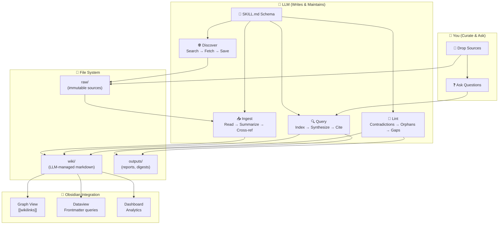

# @zosmaai/pi-llm-wiki — Architecture Diagram

This Mermaid diagram shows the three-layer architecture of the LLM Wiki pattern.



## Three-Layer Architecture

```
┌─────────────────────────────────────────────────────────┐
│                    YOU (curate & ask)                     │
├──────────────┬──────────────────────┬────────────────────┤
│   wiki/      │     outputs/         │   Obsidian vault    │
│  (read only) │  (reports, digests)  │  (graph view, UI)   │
├──────────────┴──────────────────────┴────────────────────┤
│              LLM (writes & maintains)                     │
├──────────────────────┬───────────────────────────────────┤
│      raw/            │         SKILL.md schema            │
│  (immutable sources) │     (rules & conventions)          │
└──────────────────────┴───────────────────────────────────┘
```

## Three Operations

| Operation  | Trigger              | What Happens                                                                                |
| ---------- | -------------------- | ------------------------------------------------------------------------------------------- |
| **Ingest** | Add source to `raw/` | LLM reads, creates summary, updates 5-15 wiki pages, cross-references, flags contradictions |
| **Query**  | Ask any question     | LLM searches index, reads relevant pages, synthesizes answer with `[[citations]]`           |
| **Lint**   | `/wiki:lint`         | Health check: contradictions, orphans, missing pages, stale claims, knowledge gaps          |

## Two Modes

- **👤 Personal Wiki** — Learning, journaling, goals, book notes
- **🏢 Company Wiki** — Competitive intel, change detection, battlecards
